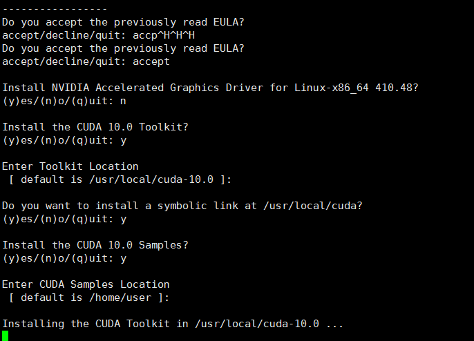
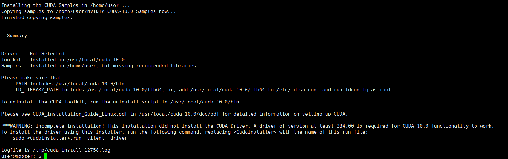
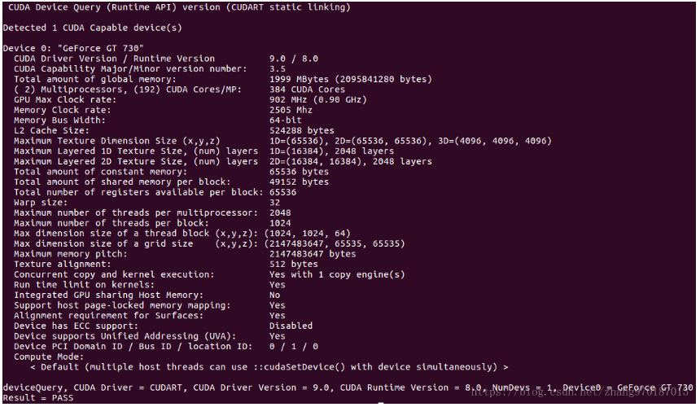

# 一、安装CUDA(根据需求选择版本）
## 1.下载
[官方下载地址](https://developer.nvidia.com/cuda-downloads)    
如果是远程可以用wget下载:    
```
wget https://developer.nvidia.com/compute/cuda/10.0/Prod/local_installers/cuda_10.0.130_410.48_linux
```
## 2.安装
还是和驱动安装一样关闭图形界面：
```
$sudo service lightdm stop
```
  
按Ctrl+Alt+F1进入命令行，输入用户名密码登录（通过Ctrl+Alt+F7可返回界面）
进入下载目录，给文件赋予执行权限（忘记文件名就ls）
```
$sudo chmod a+x cuda_8.0.61_375.26_linux 
```
  
安装cuda，注意参数    
```
$sudo ./cuda_8.0.61_375.26_linux.run --no-opengl-libs
```
* –no-opengl-files 只安装驱动文件，不安装OpenGL文件。这和驱动安装时的参数不同。
   
   
## 3.配置环境变量（可以选择环境变量配置位置）
配置环境变量的方式：(1)配置/etc/profile.或者（2）配置~/.bashrc。（3）或者export    

我配置的是/etc/profile，这样所有的用户都可以使用cuda。
```
$sudo vim /etc/profile
# 加入
export PATH=/usr/local/cuda/bin:$PATH
export LD_LIBRARY_PATH=/usr/local/cuda/lib64:$LD_LIBRARY_PATH
$source /etc/profile #使之生效
```
## 4.验证安装成功否-1
```
nvcc -V 
命令验证是否安装成功，若出现以下信息则表示安装成功： 
nvcc: NVIDIA (R) Cuda compiler driver Copyright (c) 2005-2016 NVIDIA Corporation Built on Tue_Jan_10_13:22:03_CST_2017
```
## 5.验证安装成功否-2
```
$cd /usr/local/cuda-8.0/samples/1_Utilities/deviceQuery
$sudo make
$./deviceQuery
```
  

如果结果和上述信息差不多，表示已经安装成功。
## 5.卸载cuda
```
$ sudo /usr/bin/nvidia-uninstall #uninstall driver
```
# 二、安装cuDNN(根据需求选择版本）
## 1.下载
[下载网址](https://developer.nvidia.com/cudnn)  
## 2.解压&复制
```
sudo tar -zxvf ./cudnn-8.0-linux-x64-v5.1.tgz 
sudo cp cuda/include/cudnn.h /usr/local/cuda/include 
sudo cp -a cuda/lib64/libcudnn* /usr/local/cuda/lib64
```
## 3.验证
```
# 查看CUDA版本
cat /usr/local/cuda/version.txt 
# 查看cuDNN版本
cat /usr/local/cuda/include/cudnn.h | grep CUDNN_MAJOR -A 2 
```