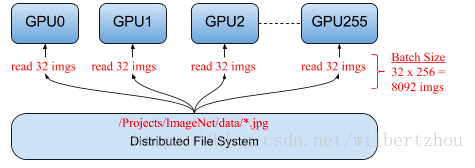

# 分布式
通过使用多个GPU服务器，减少神经网络的实验时间和训练时间。   
  
**2017年6月8日**，分布式深度学习的时代开始了。在那一天，Facebook发表了一篇paper，展示了他们将卷积神经网络（ImageNet上的RESNET-50）的训练时间从两周减少到一小时的方法，该方法使用32个服务器的256个GPU。在软件中，他们引入了一种具有非常大的mini-batch大小的技术来训练卷积神经网络（ConvNets）：使学习率与mini-batch大小成比例。这意味着任何人现在都可以使用TensorFlow将分布式训练扩展到数百个GPU。但这不是分布式TensorFlow的唯一优势：通过在许多GPU上并行运行许多实验，可以大幅缩短训练时间，这减少了为神经网络找到最优超参数所需的时间。
   
有两种方式加快模型训练速度：   
1.在许多GPU（和服务器）上运行并行实验来搜索好的超参数   
2.通过许多GPU（和服务器）分配单个网络的训练，减少训练时间
  
## 一、数据模型和模型并行
### 1.模型并行
一些神经网络模型非常庞大，无法适合单个设备（GPU）的内存，Google的神经机器翻译系统就是这种网络的一个例子。这些模型需要拆分到许多设备上（TensorFlow文档中的workers），并行地在设备上进行训练，例如，网络中的不同层可以在不同的GPU上并行训练。这种训练过程通常被称为“模型并行”（或TensorFlow文档中的“in-graphreplication”）。获得良好性能是一项挑战，文章后面不会进一步说明这种方法。
### 2.数据并行
在“**数据并行**”（或TensorFlow文档中的“between-graphreplication”）中，每个设备都使用相同的模型，但使用不同的训练样本在每个设备中训练模型。这与模型并行形成了对比，模型并行为每个设备使用相同的数据，但在设备之间切分模型。而数据并行中，每个设备将独立地计算其训练样本的预测值与标记的输出（这些训练样本的正确值）之间的误差，由于每个设备都训练不同的样本，因此它会计算模型的不同更新（“梯度”）。然而，该算法依赖于对每次新迭代使用所有处理的聚合结果，就像该算法在单个处理器上运行一样。因此，每个设备必须发送所有更新到其它所有设备中的所有模型。

在本文中，我们将重点放在数据并行上。图1显示了典型的数据并行，将32个不同的图像分配给运行单个模型的256个GPU中的每一个，一个迭代的mini-batch大小总共为8,092个图像（32 x 256）。 
   
### 3.模型并行 & 数据并行