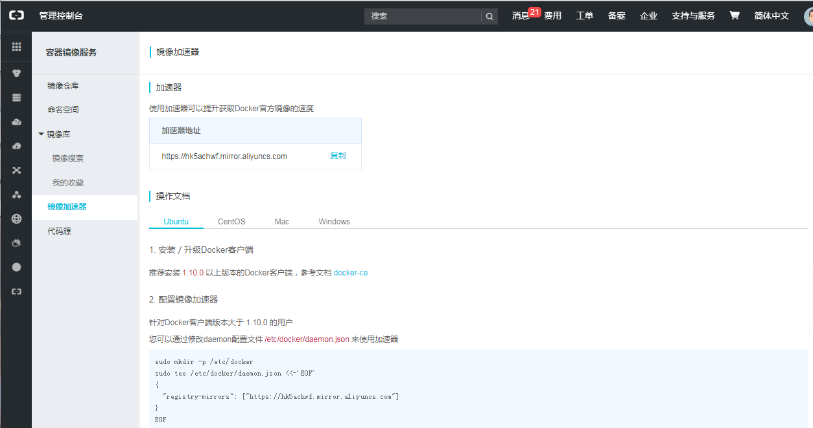

# 安装Docker-CE
Docker 在 1.13 版本之后，从 2017 年的 3 月 1 日开始，Docker 划分为 CE 和 EE。CE 即社区版（免费，支持周期三个月），EE 即企业版，强调安全，付费使用。   
  

Docker CE 每月发布一个 Edge 版本 (17.03, 17.04, 17.05…)，每三个月发布一个 Stable 版本 (17.03, 17.06, 17.09…)，Docker EE 和 Stable 版本号保持一致，但每个版本提供一年维护。
官方网站上有各种环境下的[安装指南](https://docs.docker.com/install/)。    

## 一、安装Ubuntu 维护的版本  
```  
$ sudo apt-get update 
$ sudo apt-get install docker 
```
搞定！ 但是这种方法有一个缺点：安装的不一定是最新的docker 。不过，对于docker使用没任何什么问题.（个人不建议使用这种方式安装）。

## 二、安装Docker维护的版本 
docker更推荐这种方式安装。旧版本的 Docker 称为 docker 或者 docker-engine，使用以下命令卸载旧版本：
```
$sudo apt remove docker docker-engine docker.io docker-ce
```
### 1、 开始安装Docker CE 
#### step 1: 安装必要的一些系统工具,安装docker包
```
$sudo apt udpate
$sudo apt-get install -y apt-transport-https ca-certificates curl software-properties-common
```

#### step 2: 安装GPG证书
```
$curl -fsSL https://download.docker.com/linux/ubuntu/gpg | sudo apt-key add -
```
#### Step 3: 写入软件源信息,设置stable稳定的仓库（stable稳定版每季度发布一次，Edge版每月一次）
```
$sudo add-apt-repository "http://mirrors.aliyun.com/docker-ce/linux/ubuntu  $(lsb_release -cs) stable"
```
#### Step 4: 更新并安装 Docker-CE
```
$sudo apt-get -y update
$sudo apt-get -y install docker-ce
```
或
```
# 安装指定版本的Docker-CE:
# Step 1: 查找Docker-CE的版本:
$apt-cache madison docker-ce
# Step 2: 安装指定版本的Docker-CE: (VERSION 例如上面的 17.03.1~ce-0~ubuntu-xenial)
$ sudo apt-get -y install docker-ce=[VERSION]
```

### 2、测试
```
$sudo docker version
```

### 3、阿里云镜像加速
由于国内网络问题，后续拉取Docker镜像十分缓慢，建议安装Docker之后配置国内镜像加速，这里我依然配置为阿里的加速器。    
阿里加速器：https://cr.console.aliyun.com/#/accelerator
进去之后如下图，里面有你的专属加速地址，以及不同系统的配置方式，可以直接按照他所提供的方式进行配置。(PS:需要先注册）   
   
我的配置如下：修改时请注意registry-mirrors修改为你自己的专属加速地址：    
```
vim /etc/docker/daemon.json
#  将以下添加到文件中：
{
        "registry-mirrors":["https://hk5achwf.mirror.aliyuncs.com"]
}
```
重启docker：
```
$sudo systemctl daemon-reload
$sudo systemctl restart docker
```
检查加速器是否生效：
```
docker info
# 如下在结果中看到如下说明配置成功了：
Registry Mirrors:
 https://xxxxx.mirror.aliyuncs.com/
```


### 4、添加当前用户到docker的用户组
现在每次运行docker时，都需要sudo，可以用一下方法，去掉sudo。
#### 1 创建docker用户组 
```
$ sudo groupadd docker 
```
#### 2.将当前用户加到组中 
```
$ sudo usermod -aG docker $USER 
```
注意：这里不用更改 $USER 这个参数，$USER 这个环境变量就是指当前用户名。然后重启完电脑就以后再docker命令前面不用加sudo了。

### 5、Docker 修改镜像源地址(功能和3一样)
从网上找了几个速度比较快的镜像地址：
```
Docker 官方中国区：https://registry.docker-cn.com
网易：http://hub-mirror.c.163.com
Ustc：https://docker.mirrors.ustc.edu.cn
```
**修改方法**   
* 1  
```
直接修改,设置 –registry-mirror 参数，仅对当前的命令有效 
docker run hello-world --registry-mirror=https://docker.mirrors.ustc.edu.cn
```

* 2  
```
修改 /etc/default/docker，加入 DOCKER_OPTS=”镜像地址”，可以有多个 
DOCKER_OPTS="--registry-mirror=https://docker.mirrors.ustc.edu.cn"
```
* 3
```
支持 systemctl 的系统，通过 sudo systemctl edit docker.service，会生成 etc/systemd/system/docker.service.d/override.conf 覆盖默认的参数，在该文件中加入如下内容： 
[Service] 
ExecStart= 
ExecStart=/usr/bin/docker -d -H fd:// --registry-mirror=https://docker.mirrors.ustc.edu.cn
```
* 4   
```
新版的 Docker 推荐使用 json 配置文件的方式，默认为 /etc/docker/daemon.json，非默认路径需要修改 dockerd 的 –config-file，在该文件中加入如下内容： 
{ 
"registry-mirrors": ["https://docker.mirrors.ustc.edu.cn"] 
}
```
