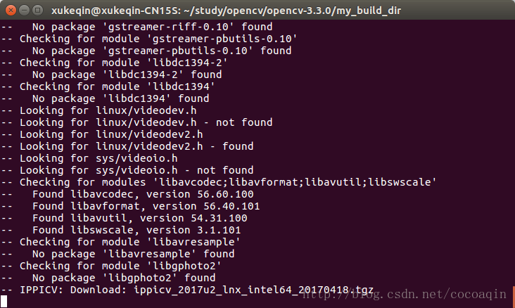

# AI 镜像封装（CUDA9.0的标签是9.0，CUDA10.0的标签是10.0）
## 一、封装CUDA
使用镜像：`nvidia/cuda:9.0-cudnn7-devel`   
Image: `sitonholy/cuda:16.04-9.0`    
**封装过程**：   
### 1 . 去[nvidia官网](https://hub.docker.com/r/nvidia/cuda)下载镜像   
```
docker pull nvidia/cuda:9.0-cudnn7-devel
```
### 2. 安装vim
### 3. 修改apt源
### 4. 修改标签为`sitonholy/cuda:16.04-9.0`   
## 二、安装python
使用镜像：`sitonholy/cuda:16.04-9.0`      
Image: `sitonholy/python:16.04-9.0-3.5`     
### 安装过程：   
```
apt install python3
apt install python3-pip
cd /usr/bin 
sudo rm python 
sudo ln -s python3.5m python
```
封装镜像
## 三、安装opencv3
使用镜像：`sitonholy/python:16.04-9.0-3.5`      
Image: `sitonholy/opencv:16.04-9.0-3.5-4.1.0`     
**封装过程**：   
### 1 .安装cmake等依赖   
```
apt install openssh-server curl
``` 
```
$apt-get install -y cmake build-essential libgtk2.0-dev libavcodec-dev libavformat-dev libjpeg.dev libtiff4.dev libswscale-dev libjasper-dev
```
### 2 .[下载](http://opencv.org/releases.html)OpenCV-4.1.0  
```
apt install git
git clone https://github.com/opencv/opencv/tree/4.1.0
```
或者官方下载   
```
$unzip opencv-3.4.1.zip
$cd opencv-3.4.1 
$mkdir my_build_dir
$cd my_build_dir
```
### 3 .编译   
Cmake一下
```
$cmake -D CMAKE_BUILD_TYPE=Release -D CMAKE_INSTALL_PREFIX=/usr/local ..
```
   
```
可能这里需要很长时间，所以要提前下载下来：
—————— start
1、下载　ippicv_2019_lnx_intel64_general_20180723.tgz文件,以存到iCloud。
2、修改配置文件
修改opencv里相关配置文件
打开终端，输入
    gedit ~/DownLoad/opencv_source/opencv/3rdparty/ippicv/ippicv.cmake #就是这个文件的路径
将47行的
     "https://raw.githubusercontent.com/opencv/opencv_3rdparty/${IPPICV_COMMIT}/ippicv/"
改为步骤1中手动下载的文件的本地路径：
    "file:~/Downloads/" #（仅供参考，根据自己的路径填写）
编辑完成保存退出。
——————— end
```
Cmake后   
```
--     Linker flags (Release):      -Wl,--gc-sections  
--     Linker flags (Debug):        -Wl,--gc-sections  
--     ccache:                      NO
--     Precompiled headers:         YES
--     Extra dependencies:          dl m pthread rt
--     3rdparty dependencies:
-- 
--   OpenCV modules:
--     To be built:                 calib3d core dnn features2d flann gapi highgui imgcodecs imgproc ml objdetect photo stitching ts video videoio
--     Disabled:                    world
--     Disabled by dependency:      -
--     Unavailable:                 java js python2 python3
--     Applications:                tests perf_tests apps
--     Documentation:               NO
--     Non-free algorithms:         NO
-- 
--   GUI: 
--     GTK+:                        YES (ver 2.24.30)
--       GThread :                  YES (ver 2.48.2)
--       GtkGlExt:                  NO
--     VTK support:                 NO
-- 
--   Media I/O: 
--     ZLib:                        /usr/local/anaconda3/envs/sitonholy/lib/libz.so (ver 1.2.11)
--     JPEG:                        /usr/lib/x86_64-linux-gnu/libjpeg.so (ver 80)
--     WEBP:                        build (ver encoder: 0x020e)
--     PNG:                         /usr/lib/x86_64-linux-gnu/libpng.so (ver 1.2.54)
--     TIFF:                        build (ver 42 - 4.0.10)
--     JPEG 2000:                   /usr/lib/x86_64-linux-gnu/libjasper.so (ver 1.900.1)
--     OpenEXR:                     build (ver 1.7.1)
--     HDR:                         YES
--     SUNRASTER:                   YES
--     PXM:                         YES
--     PFM:                         YES
-- 
--   Video I/O:
--     DC1394:                      NO
--     FFMPEG:                      YES
--       avcodec:                   YES (56.60.100)
--       avformat:                  YES (56.40.101)
--       avutil:                    YES (54.31.100)
--       swscale:                   YES (3.1.101)
--       avresample:                NO
--     GStreamer:                   NO
--     v4l/v4l2:                    YES (linux/videodev2.h)
-- 
--   Parallel framework:            pthreads
-- 
--   Trace:                         YES (with Intel ITT)
-- 
--   Other third-party libraries:
--     Intel IPP:                   2019.0.0 Gold [2019.0.0]
--            at:                   /root/opencv-4.1.0/mybuild/3rdparty/ippicv/ippicv_lnx/icv
--     Intel IPP IW:                sources (2019.0.0)
--               at:                /root/opencv-4.1.0/mybuild/3rdparty/ippicv/ippicv_lnx/iw
--     Lapack:                      NO
--     Eigen:                       NO
--     Custom HAL:                  NO
--     Protobuf:                    build (3.5.1)
-- 
--   OpenCL:                        YES (no extra features)
--     Include path:                /root/opencv-4.1.0/3rdparty/include/opencl/1.2
--     Link libraries:              Dynamic load
-- 
--   Python (for build):            /usr/bin/python2.7
-- 
--   Java:                          
--     ant:                         NO
--     JNI:                         NO
--     Java wrappers:               NO
--     Java tests:                  NO
-- 
--   Install to:                    /usr/local
-- -----------------------------------------------------------------
-- 
-- Configuring done
-- Generating done
-- Build files have been written to: /root/opencv-4.1.0/mybuild

```
### 4 . 安装
```
$make -j32
$sudo make install
```
### 5.安装python-Opencv
可直接使用apt安装
```
sudo apt-get install python-opencv
sudo apt-get install python-numpy
```
### 6.安装
```
pip install -i https://pypi.tuna.tsinghua.edu.cn/simple opencv-python  opencv-contrib-python
```
### 7.测试
打开python，importcv模块成功即可。
```
import cv2
```
## 三、安装AI相关的库
使用镜像：`sitonholy/opencv:16.04-9.0-3.5-4.1.0`   
封装镜像：`sitonholy/ai:9.0-v3`     
```
# 深度学习相关库
pip install -i https://pypi.tuna.tsinghua.edu.cn/simple torch torchvision tensorboardx 
pip install -i https://pypi.tuna.tsinghua.edu.cn/simple tensorflow keras
pip install -i https://pypi.tuna.tsinghua.edu.cn/simple mxnet-cu90

# 机器学习相关
pip install -i https://pypi.tuna.tsinghua.edu.cn/simple sklearn matplotlib pandas numpy Pillow

# 学习工具
pip install -i https://pypi.tuna.tsinghua.edu.cn/simple jupyter jupyterlab

启动jupyter命令
jupyter notebook --ip=0.0.0.0 --allow-root --port=8888


```
### 软件库列表     
```
(sitonholy) root@08afc00e88fd:/# pip list
Package             Version    
------------------- -----------
absl-py             0.7.1      
astor               0.7.1      
bleach              1.5.0      
certifi             2019.3.9   
chardet             3.0.4      
cycler              0.10.0     
gast                0.2.2      
graphviz            0.8.4      
grpcio              1.20.1     
h5py                2.9.0      
html5lib            0.9999999  
idna                2.8        
joblib              0.13.2     
Keras               2.2.4      
Keras-Applications  1.0.7      
Keras-Preprocessing 1.0.9      
kiwisolver          1.1.0      
Markdown            3.1        
matplotlib          3.0.3      
mxnet-cu90          1.4.0.post0
numpy               1.14.6     
Pillow              6.0.0      
pip                 19.1.1     
protobuf            3.7.1      
pyparsing           2.4.0      
python-dateutil     2.8.0      
PyYAML              5.1        
requests            2.21.0     
scikit-learn        0.21.1     
scipy               1.2.1      
setuptools          41.0.1     
six                 1.12.0     
sklearn             0.0        
tensorboard         1.8.0      
tensorflow-gpu      1.8.0      
termcolor           1.1.0      
torch               1.1.0      
torchvision         0.2.2.post3
urllib3             1.24.3     
Werkzeug            0.15.4     
wheel               0.33.2
```


