# Ubuntu 16.04 Server 版安装过程图文详解
如何制作Ubuntu 16.04 server的镜像，自己百度。   
进入系统安装的第一个界面，开始系统的安装操作。每一步的操作，左下角都会提示操作方式！！
### 1.选择系统语言-English  
   
### 2.选择操作-Install Ubuntu Server
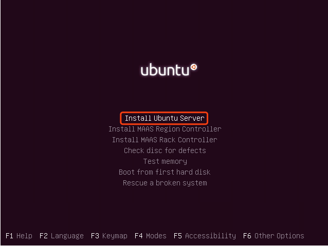   
### 3.选择安装过程和系统的默认语言-English
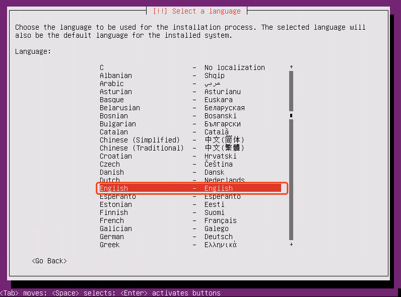   
### 4.选择区域-other
   
### 5.选择亚洲-Asia
   
### 6.选择国家-China
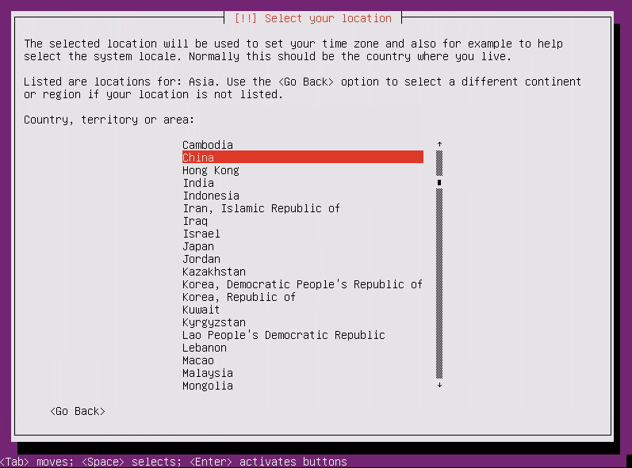   
### 7.选择字符集编码-United States
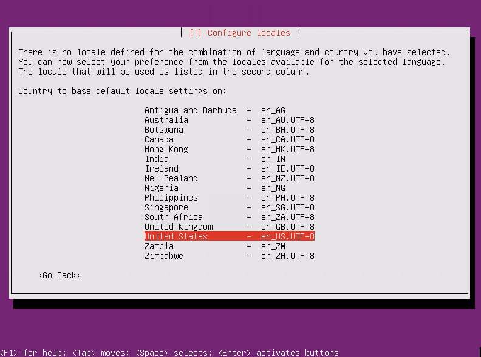   
### 8.是否扫描和配置键盘，选择否-No
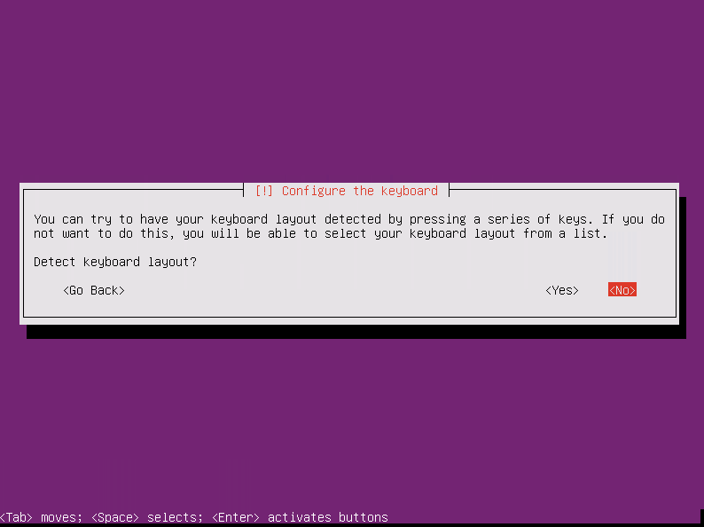   
### 9.选择键盘类型-English (US)
   
### 10.选择键盘布局-English (US)
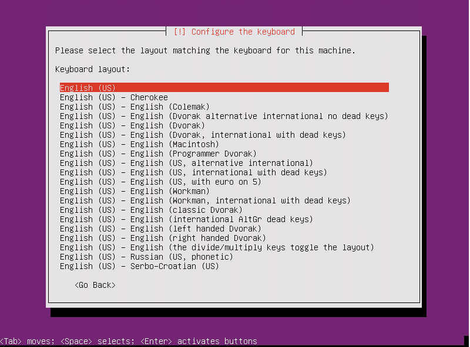   
### 11.配置网络，因为内网没开DHCP ,暂时等装完系统在进行配置
    
### 12.设置主机名称(自行设置，这里我设置为“ubuntu”)-Continue
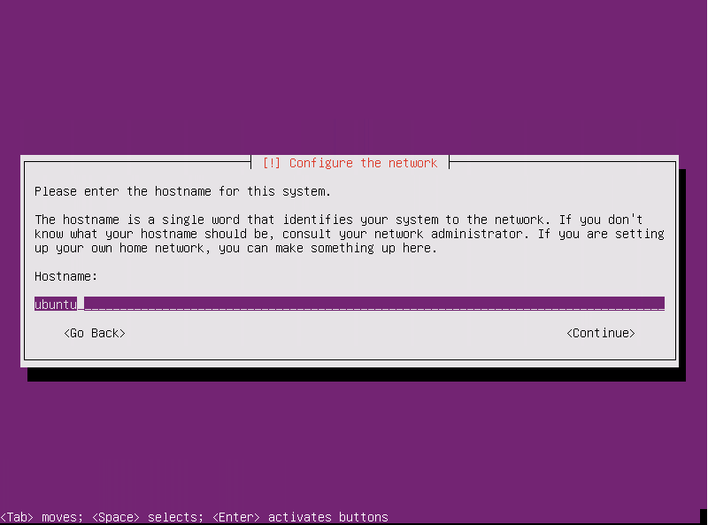   
### 13.设置用户全名(这里为“myuser”)-Continue
   
### 14.设置登录账号(这里为“myuser”)-Continue；
   
### 15.设置登录密码(空格选择“Show Password in Clear”可以显示密码)-Continue；
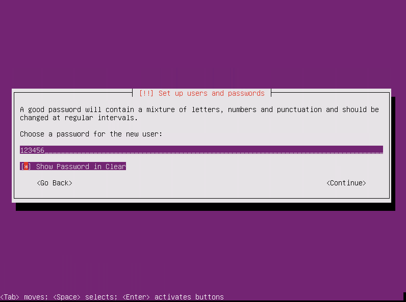   
### 16.重复上一步设置的登录密码-Continue；
   
### 17.是否加密home文件夹，选择否-No
  
### 18.选择分区方式(分区向导-使用整个磁盘)-“Guided - use entire disk and set up LVM”
   
### 19.选择要分区的磁盘(这里只有一块)
   
### 20.是否将变更写入磁盘，选择是-Yes
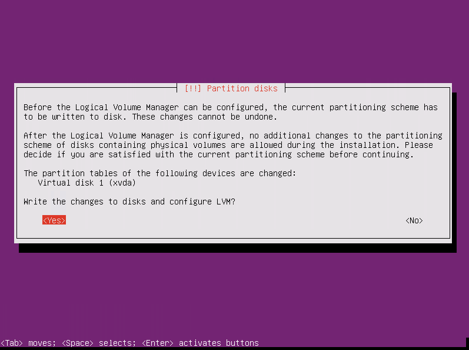   
   
### 21.磁盘分区选择NO,这里要把boot分区给删了
   
### 22.选择/boot回车-delete the partition
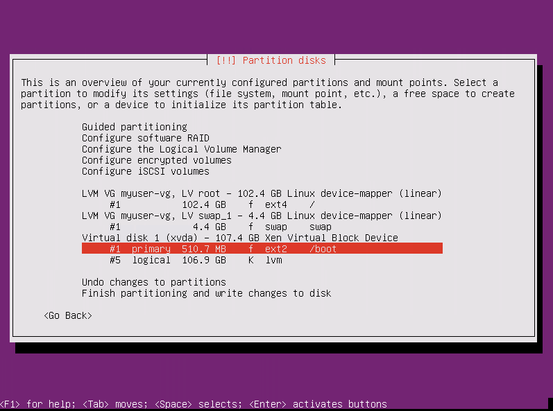   
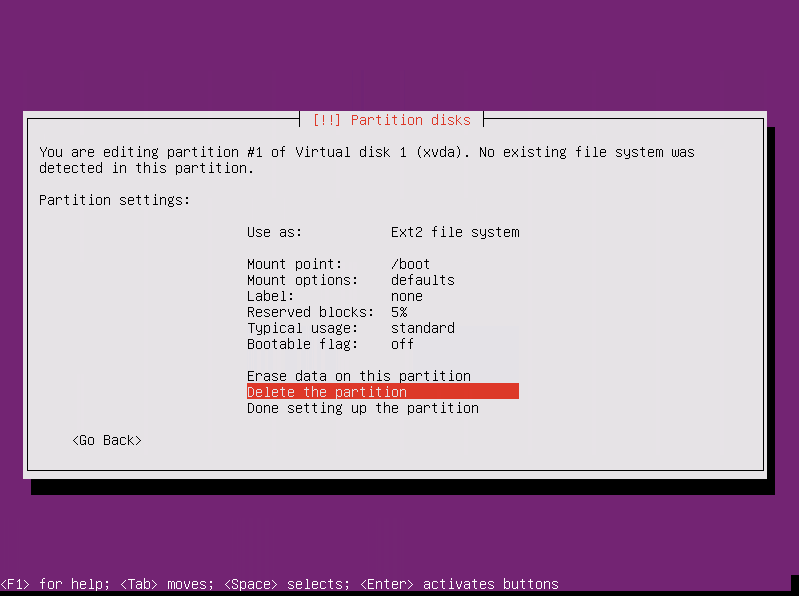   
### 23.完成分区
   
### 24.选择Yes

### 25.选择升级方式，No automatic updates
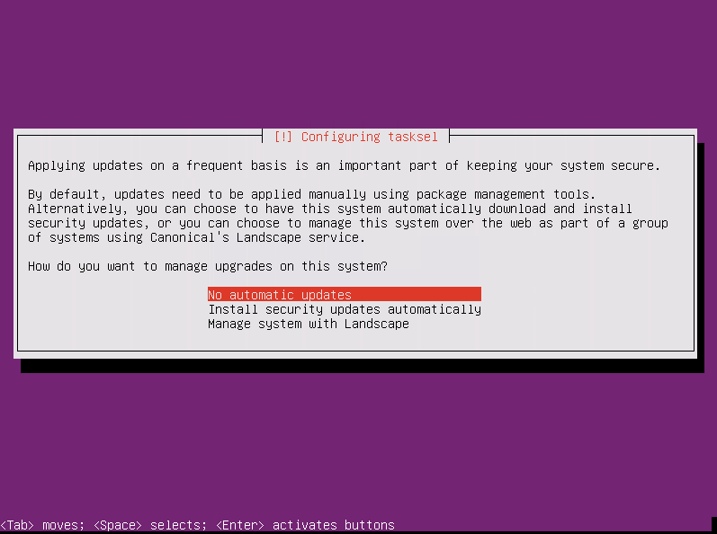   
### 26.选择要安装的软件，多加一个OpenSSH Server
   
### 27.是否安装GRUB引导程序，选择是-Yes
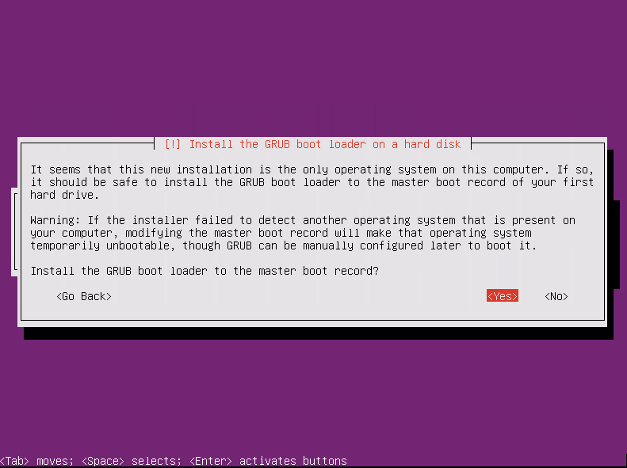   
### 28.完成安装，选择下一步-Continue
   
### 29.系统安装完会自动启动主机，然后输入设置好的登录账户和密码就可以开始使用了
 