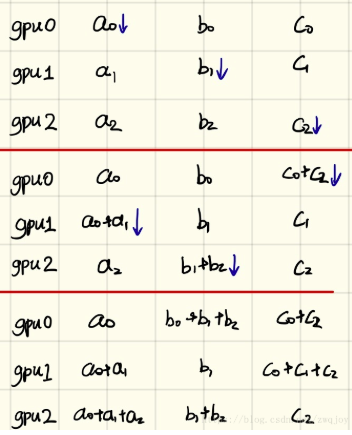

# 架构
在模型并行、数据并行、模型并行&数据并行的方式选定后，接下来要选择，**多GPU服务器的组织方式**（PS or Ring）和 **参数更新**（同步 or 异步）。 
## 一、PS or Ring
### 1. 参数服务器架构
当并行SGD使用参数服务器时，算法首先将模型广播给workers（设备）。在每次训练迭代中，每个worker从mini-batch中读取自己的部分，计算其自己的梯度，并将这些梯度发送到一个或多个参数服务器。参数服务器汇总来自worker的所有梯度，并等到所有workers完成之后，才计算下一次迭代的新模型，然后将其广播给所有workers。数据流如图所示。
   
*同步随机梯度下降的参数服务器架构 图片由Jim Dowling提供。*
### 2. Ring – allreduce架构
在ring-allreduce架构中，没有中央服务器负责聚合来自workers的梯度。相反，在训练迭代中，每个worker读取它自己的mini-batch部分，计算其梯度，将梯度发送到环上的后继邻居，并从环上的前一个邻居接收梯度。对于具有N个worker的环，所有workers将在每个worker发送和接收N-1个梯度消息之后收到计算更新模型所需的梯度。 Ring-allreduce是带宽最优化的，因为它可以确保每个主机上可用的上传和下载的网络带宽得到充分利用（与参数服务器方式不同）。Ring-allreduce还可以将深层神经网络中较低层的梯度计算与高层梯度的传输重叠，从而进一步缩短训练时间。数据流如图所示。
   
相比PS架构，Ring-allreduce架构是带宽优化的，因为集群中每个节点的带宽都被充分利用。此外，在深度学习训练过程中，计算梯度采用BP算法，其特点是后面层的梯度先被计算，而前面层的梯度慢于前面层，Ring-allreduce架构可以充分利用这个特点，在前面层梯度计算的同时进行后面层梯度的传递，从而进一步减少训练时间。在百度的实验中，他们发现训练速度基本上线性正比于GPUs数目（worker数）。

一般的多卡gpu训练有一个很大的缺陷，就是因为每次都需要一个gpu（cpu）从其他gpu上收集训练的梯度，然后将新的模型分发到其他gpu上。这样的模型最大的缺陷是gpu 0的通信时间是随着gpu卡数的增长而线性增长的。

所以就有了ring-allreduce，如下图：
  
算法的基本思想是取消Reducer，让数据在gpu形成的环内流动，整个ring-allreduce的过程分为两大步，第一步是scatter-reduce，第二步是allgather。

先说第一步：首先我们有n块gpu，那么我们把每个gpu上的数据（均等的）划分成n块，并给每个gpu指定它的左右邻居（图中0号gpu的左邻居是4号，右邻居是1号，1号gpu的左邻居是0号，右邻居是2号……），然后开始执行n-1次操作，在第i次操作时，gpu j会将自己的第(j - i)%n块数据发送给gpu j+1，并接受gpu j-1的(j - i - 1)%n块数据。并将接受来的数据进行reduce操作，示意图如下：
  
当n-1次操作完成后，ring-allreduce的第一大步scatter-reduce就已经完成了，此时，第i块gpu的第(i + 1) % n块数据已经收集到了所有n块gpu的第(i + 1) % n块数据，那么，再进行一次allgather就可以完成算法了。

第二步allgather做的事情很简单，就是通过n-1次传递，把第i块gpu的第(i + 1) % n块数据传递给其他gpu，同样也是在i次传递时，gpu j把自己的第(j - i - 1)%n块数据发送给右邻居，接受左邻居的第(j - i - 2) % n数据，但是接受来的数据不需要像第一步那样做reduce，而是直接用接受来的数据代替自己的数据就好了。

最后每个gpu的数据就变成了这样：
  
首先是第一步，scatter-reduce：  
    

然后是allgather的例子：  
  
Horovod 是 Uber 开源的又一个深度学习工具，它的发展吸取了 Facebook「一小时训练 ImageNet 论文」(《Accurate, Large Minibatch SGD: Training ImageNet in 1 Hour 》)与百度 Ring Allreduce 的优点，可为用户实现分布式训练提供帮助。本文将简要介绍这一框架的特性。    
Deep Learning training说白了是浮点数运算，非常适合以MPI为核心的并行计算。之前Google，百度，以及Facebook那篇ImageNet in one hour也用的是MPI。   

## 二、同步与异步分布式训练
随机梯度下降（SGD）是用于寻找最优值的迭代算法，是AI中最受欢迎的训练算法之一，它涉及多轮训练，每轮的结果都更新到模型中，以备下一轮训练，每轮训练可以在多个设备上同步或异步运行。
 
每次SGD迭代运行一个mini-batch的训练样本（Facebook拥有8,092张图像的大尺寸mini-batch）。在同步训练中，所有设备都使用单个（大尺寸）mini-batch数据的不同部分来训练其本地模型，然后将他们本地计算的梯度（直接或间接）传送给其它所有设备，只有在所有设备成功计算并发送了梯度后，模型才会更新。然后将更新后的模型和下一个mini-batch的拆分一起发送到所有节点。也就是说，设备在mini-batch的非重叠分割的子集上进行训练。

虽然并行有很大的加速训练的潜力，但它自然会引入开销，大型模型和慢速网络会增加训练时间。如果有失速（慢速设备或网络连接），训练可能会失速。我们还希望减少训练模型所需的迭代次数，因为每次迭代都需要将更新的模型广播到所有节点。实际上，这意味着尽可能增加mini-batch的尺寸，以免降低训练模型的准确性。

在他们的论文中，Facebook介绍了针对学习率的线性缩放规则，可以用大尺寸mini-batch进行训练，该规则规定“当mini-batch大小乘以k时，将学习率也同样乘以k”，但条件是在达到目标学习率之前，学习率应该在几个epochs内缓慢增加。
在异步训练中，没有设备等待来自任何其他设备的模型更新。这些设备可以独立运行并与对等设备共享结果，或通过一个或多个称为“参数”服务器的中央服务器进行通信。在对等架构中，每个设备运行一个循环，读取数据，计算梯度，将它们（直接或间接）发送到所有设备，并将模型更新为最新版本。在更中心化的架构中，设备以梯度的形式将其输出发送到参数服务器，这些服务器收集和聚合梯度。在同步训练中，参数服务器计算模型最近的最新版本，并将其发送回设备。在异步训练中，参数服务器将梯度发送到本地计算新模型的设备。在这两种架构中，循环重复直到训练结束。图2说明了异步和同步训练之间的区别。
 
  
  

