# Tensor Core
不久前，NVIDIA在SIGGRAPH 2018上正式发布了新一代GPU架构——Turing（图灵），黄仁勋称Turing架构是自2006年CUDA GPU发明以来最大的飞跃。Turing架构的两大重要特性便是集成了用于光线追踪的RT Core以及用于AI计算的Tensor Core，使其成为了全球首款支持实时光线追踪的GPU。

不过说到AI计算，NVIDIA GPU成为最好的加速器早已是公认的事实，但将Tensor Core印上GPU名片的并不是这次的Turing，而是他的上任前辈——Volta。   

基于Volta架构的Titan V是NVIDIA在计算领域成就的集大成者。深度学习和神经网络已成为NVIDIA GPU的背后驱动力，作为最先进的计算加速器，它集成了用于机器学习操作的内置硬件和软件加速，深度学习能力完全可以被当做Titan V和Volta的名片。
## 一、GPU与深度学习
首先要说明的是，虽然“机器学习”或更通用的“AI”有时可互换用于“深度学习”，但从技术上讲，它们各自指的是不同的东西，机器学习是AI的子集，深度学习则是机器学习的子集。    
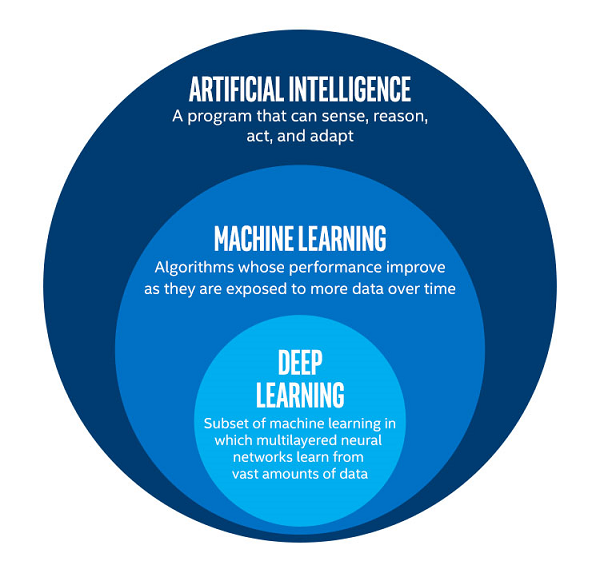   

深度学习是因“深度神经网络”（Deep Neural Networks）而得名，其最终被设计为识别数据中的模式，产生相关预测，接收关于预测准确度的反馈，然后基于反馈进行自我调整。计算发生在“节点”上，“节点”被组织成“层”：原始输入数据首先由“输入层”处理，“输出层”推出代表模型预测的数据。两者之间的任何一层都被称为“隐藏层”，而“deep”则代表着深度神经网络有许多隐藏层。

这些隐藏层可以在不断增加的抽象层次上运行，使得它们甚至可以从复杂的输入数据中提取和区分非线性特征。一个标准的例子是图像识别，其中初始层寻找某些边缘或形状，这通知后面的层寻找鼻子和眼睛，之后的层可能寻找面部。最后的图层组合了所有这些数据以进行分类。

随着输入数据在模型中向前推进，计算包括特殊的内部参数（权重），最后会产生一个表示模型预测与正确值之间误差的损失函数。然后使用此错误信息反向运行模型以计算将改善模型预测的权重调整，该前向和后向传递（或反向传播）序列包括单个训练迭代。

为了进行推断，这个过程自然地排除了逆向传递，最终需要的计算强度比训练模型更小。从这个意义上说，推断也不太需要像FP32这样高的精度，并且可以对模型进行适当的修剪和优化，以便在特定的设备上部署。然而推断设备对延迟、成本和功耗变得更加敏感，尤其是在边缘计算的场景下。

卷积神经网络（CNN）和递归神经网络（RNN）是深度神经网络的两个重要子类型。卷积本身是一种操作，将输入数据和卷积核结合起来形成某种特征映射，转换或过滤原始数据以提取特征。

CNN通常是“前馈”的，因为数据在没有循环的情况下流过各层。而对于RNN（以及像LSTM和GRU这样的变体）来讲，每次计算后都会有一个单独的权重循环回自身，给网络一种“记忆”感，这让网络能够做出有时间意识的预测，在文本分析等场景中很有用。

由于深度学习数学可以归结为线性代数，因此某些操作可以重写为对GPU更友好的矩阵间乘法。当NVIDIA首次开发并公布cuDNN时，其中一个重要实现就是将算法降级为矩阵乘法以加速卷积。多年来cuDNN的发展包括“预先计算的隐式GEMM”卷积算法，它恰好是触发Tensor Core卷积加速的唯一算法。

## 二、NVIDIA GPU的优势
对于深度学习训练来说，GPU已经成为加速器的最佳选择。大多数计算本质上是**并行的浮点计算**，即**大量的矩阵乘法**，其最佳性能需要大量的内存带宽和大小，这些需求与HPC的需求非常一致，GPU正好可以提供高精度浮点计算、大量VRAM和并行计算能力，NVIDIA的CUDA可谓恰逢其时。

CUDA和NVIDIA的计算业务的发展与机器学习的研究进展相吻合，机器学习在2006年左右才重新成为“深度学习”。GPU加速神经网络模型相比CPU可提供数量级的加速，反过来又将深度学习重新推广到如今的流行词汇。与此同时，NVIDIA的图形竞争对手ATI在2006年被AMD收购；OpenCL 1.0在2009年才发布，同年AMD剥离了他们的GlobalFoundries晶圆厂。

随着DL的研究人员和学者们成功地使用CUDA来更快地训练神经网络模型，NVIDIA才发布了他们的cuDNN库的优化深度学习原语，其中有很多以HPC为中心的BLAS（基本线性代数子例程）和相应的cuBLAS先例，cuDNN将研究人员创建和优化CUDA代码以提高DL性能的需求抽象出来。至于AMD的同类产品MIOpen，去年才在ROCm保护伞下发布，目前也只在Caffe公开发布。

所以从这个意义上讲，尽管NVIDIA和AMD的底层硬件都适合DL加速，但NVIDIA GPU最终成为了深度学习的参考实现。
## 三、剖析Tensor Core
在关于Volta混合精度Tensor Core的几个谜团中，一个比较烦人的问题是4×4矩阵乘法的能力。Tensor Core是一种新型处理核心，它执行一种专门的矩阵数学运算，适用于深度学习和某些类型的HPC。Tensor Core执行融合乘法加法，其中两个4*4 FP16矩阵相乘，然后将结果添加到4*4 FP16或FP32矩阵中，最终输出新的4*4 FP16或FP32矩阵。

NVIDIA将Tensor Core进行的这种运算称为**混合精度数学**，因为输入矩阵的精度为半精度，但乘积可以达到完全精度。碰巧的是，Tensor Core所做的这种运算在深度学习训练和推理中很常见。

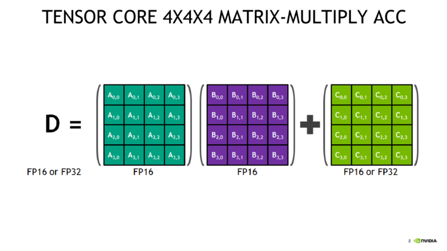   
Tensor Core虽然在GPU里是全新的运算单元，但其实它与标准的ALU（算术逻辑单元）流水线并没有太大差别，只不过Tensor Core处理的是大型矩阵运算，而不是简单地单指令流多数据流标量运算。Tensor Core是灵活性和吞吐量权衡的选择，它在执行标量运算时的表现很糟糕，但它可以将更多的操作打包到同一个芯片区域。

Tensor Core虽然有一定的可编程性，但仍然停留在4\*4矩阵乘法累加层面上，并且不清楚累积步骤是如何以及何时发生的。尽管被描述为进行4\*4矩阵数学运算，但实际上Tensor Core运算似乎总是使用16\*16矩阵，并且操作一次跨两个Tensor Core进行处理。这似乎与Volta架构中的其他变化有关，更具体地说，与这些Tensor Core是如何集成进SM中有关。
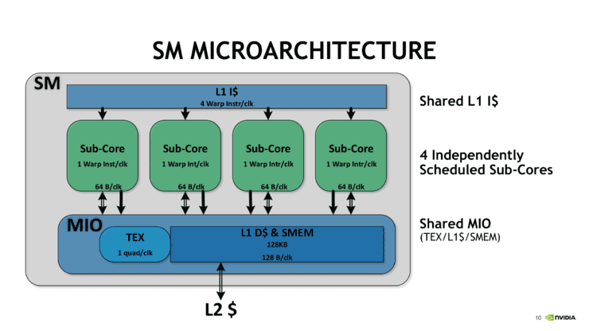   

对于Volta架构，SM被划分为四个处理块或子核。对于每个子核，调度器每个时钟向本地分支单元（BRU）、Tensor Core阵列、数学分派单元或共享MIO单元发出一个warp指令，这就首先阻止了Tensor运算和其他数学运算同时进行。在利用两个Tensor Core时，warp调度器直接发出矩阵乘法运算，并且在从寄存器接收输入矩阵之后，执行4*4*4矩阵乘法。待完成矩阵乘法后，Tensor Core再将得到的矩阵写回寄存器。

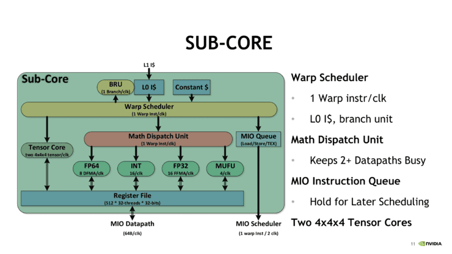   
在Tensor Core执行实际指令时，即使在使用NVVM IR（LLVM）的编译器级别上，也仅存在用于warp级矩阵操作的本征，对于CUDA++和PTX ISA，warp级别仍然是唯一级别。加载输入矩阵的形式是每个扭曲线程持有一个片段，其分布和身份均未指定。从广义上讲，它遵循标准CUDA核心的基于线程级别拼接的GEMM计算的相同模式。

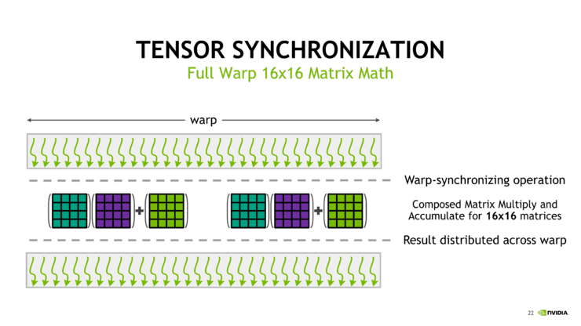   
一般而言，给定A\*B+C Tensor Core操作，片段由A的8个FP16\*2元素（即16个FP16元素）和B的另外8个FP16\*2元素，以及FP16累加器的4个FP16\*2元素或 FP32累加器的8个FP32元素组成。

在矩阵乘法累加运算之后，计算结果会分散在每个线程的目标寄存器片段中，需要在整个范围内统一，如果其中一个warp线程退出，这些低级操作基本上就会失败。

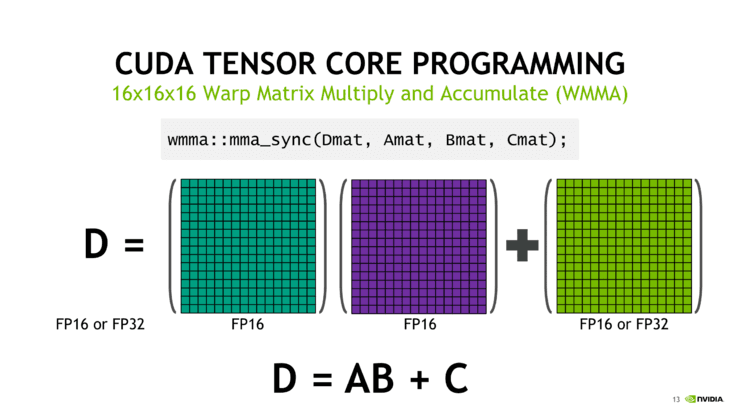   
Citadel LLC团队的低级微基准测试揭示了许多Volta微体系结构细节，包括Tensor Core操作和相关的片段，与输入矩阵相比，它们都位于寄存器和标识中。他们观察到，子核核心以特定的拼接模式计算矩阵乘法，其中所有32个warp线程都在运行。
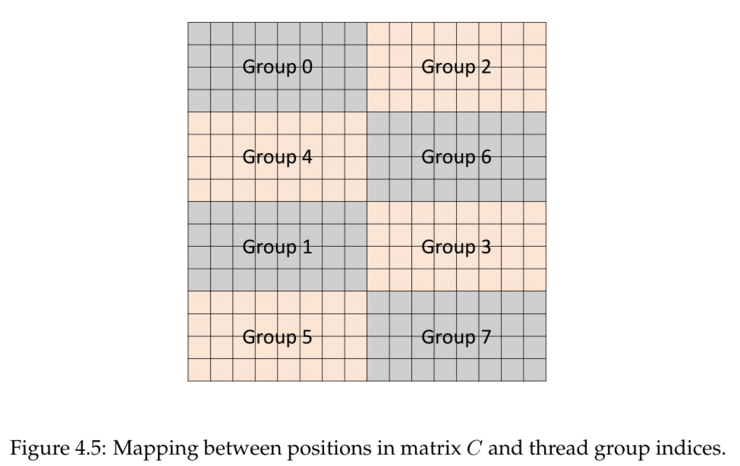   

从概念上讲，Tensor Core在4\*4子矩阵上运行，以计算更大的16\*16矩阵。warp线程被分成8组，每组4个线程，每个线程组连续计算一个8\*4块，总共要经过4组的过程，每一个线程组都处理了目标矩阵的1/8。

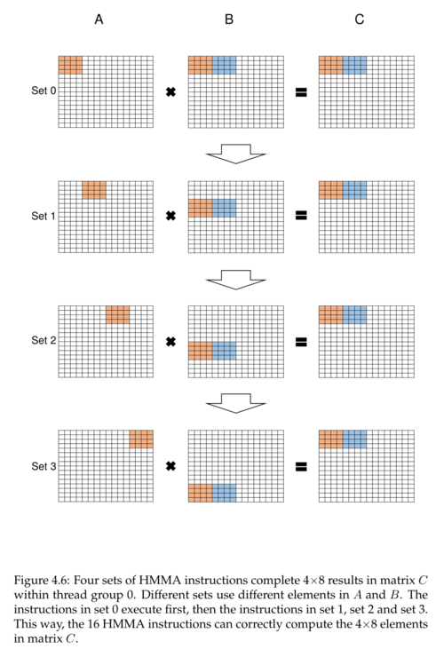   

在一个集合中，可以并行完成四个HMMA步骤，每个步骤适用于4\*2子块。这四个线程直接链接到寄存器中的那些矩阵值，因此线程组可以处理单个Step 0 HMMA指令，从而一次性计算子块。

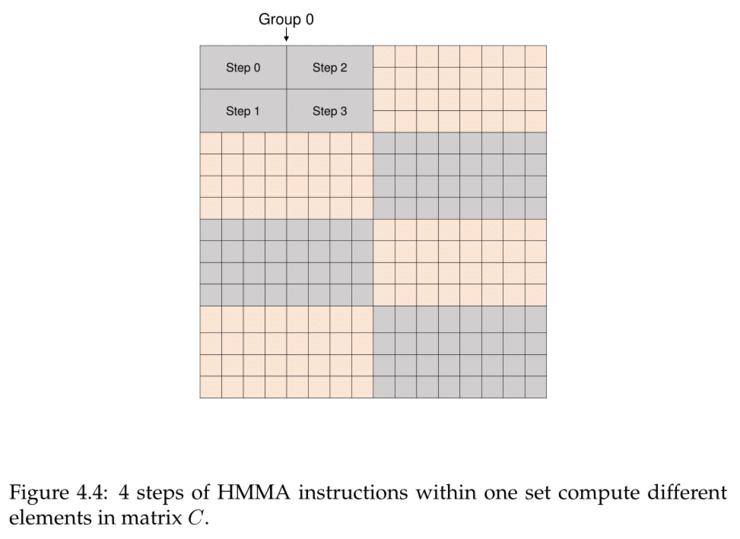   

由于矩阵乘法在数学上需要对某些行列进行复用，以允许跨所有8*4块并行执行，每个4*4矩阵被映射到两个线程的寄存器。在计算16*16父矩阵的4*4次子矩阵运算中，这将包括将连续计算的集合相加，形成16*16矩阵中4*8个元素的相应块。尽管Citadel没有对FP16进行测试，但它们发现FP16 HMMA指令只产生2个步骤，而不是4个步骤，这或许与FP16只占用的较小的寄存器空间有关。

    
通过独立的线程调度和执行，以及warp同步和warp-wide结果分配，基本的4\*4\*4 Tensor Core操作转换为半可编程16\*16\*16混合精度矩阵乘法累加。虽然CUDA 9.1支持32\*8\*16 and 8\*32\*16矩阵，但相乘的矩阵都需要相应的列和行为16，最终矩阵为32\*8或8\*32。

Tensor Core的运行方式似乎是NVIDIA GEMM计算层次结构的一个硬件实现的步骤，如CUTLASS（用于GEMM操作的CUDA C ++模板库）中所示。对于传统的CUDA核心，最后一步需要将warp tile结构分解为由各个线程拥有的标量和向量元素。使用WMMA API（现在表示张量核），所有这些都被抽象掉了，只剩下了需要处理的合作矩阵片段加载/存储和多重积累。积累发生在一个FMA类型的操作中。

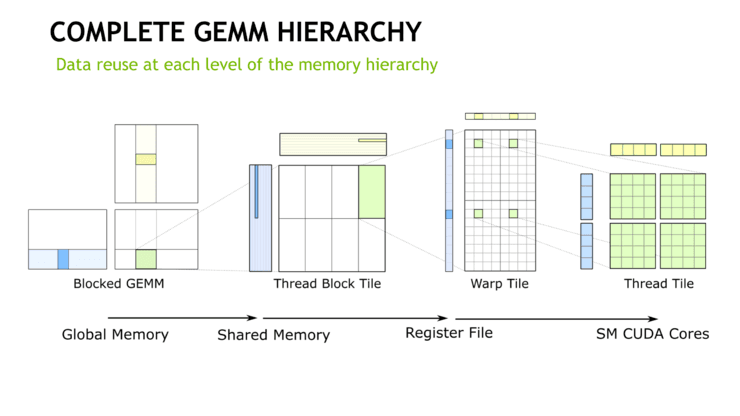    

在寄存器级别上，NVIDIA在他们的Hot Chips 2017论文中提到“使用三个相对较小的乘法和累加器数据的4\*4矩阵，可以执行64次乘加运算。”而增强的Volta SIMT模型的每线程程序计数器（能够支持张量核）通常需要每个线程2个寄存器槽。HMMA指令本身会尽可能多复用寄存器，所以我无法想象寄存器在大多数情况下不会出现瓶颈。

对于独立的4*4矩阵乘法累加，Tensor Core阵列在寄存器、数据路径和调度方面很有核能并没有物理设计，它只能用于特定的子矩阵乘法。

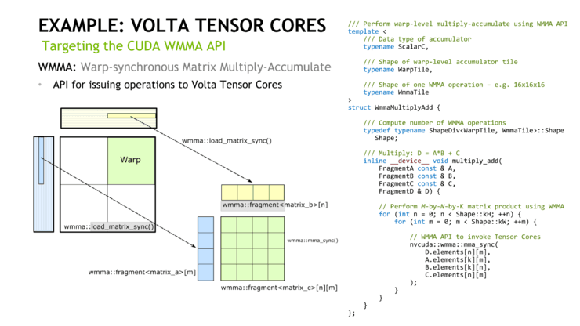   

无论如何，从NVIDIA的角度来看，Volta不是一颗深度学习的专用ASIC，它仍然覆盖GPGPU的领域，因此保持CUDA可编程Tensor Core适用于GEMM / cuBLAS和HPC是合乎逻辑的。对于CUDA c++的CUTLASS来说，情况更是如此，因为它的WMMA API支持旨在为广泛的应用程序启用Tensor CoreGEMM操作。从根本上说，NVIDIA深度学习硬件加速的发展与cuDNN（以及cuBLAS）的发展有很大关系。

## 四、让FP16适用于深度学习
Volta的深度学习能力是建立在利用半精度浮点（IEEE-754 FP16）而非单精度浮点（FP32）进行深度学习训练的基础之上。

该能力首先由cuDNN 3支持并在Tegra X1的Maxwell架构中实现，随后原生半精度计算被引入Pascal架构并被称为“伪FP16”，即使用FP32 ALU处理成对的FP16指令，理论上可以使每个时钟的FP16吞吐量增加一倍。这一特性实际上已经在Tensor Core处理寄存器中矩阵片段的过程中得到体现，其两个FP16输入矩阵被收集在8个FP16*2或16个FP16元素中。

就FP32与FP16而言，由于单精度浮点所包含的数据多于半精度浮点，因此计算量更大，需要更多的内存容量和带宽来容纳和传输数据，并带来更大的功耗。因此，在计算中成功使用低精度数据一直是穷人的圣杯，而目标则是那些不需要高精度数据的应用程序。
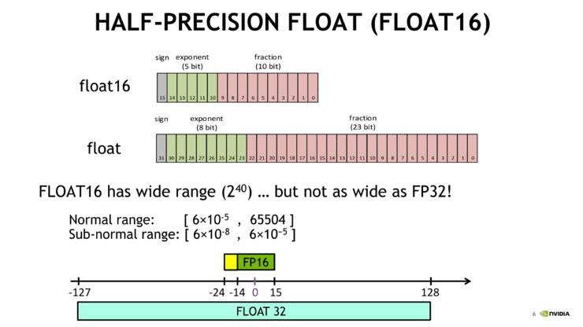   

除了API/编译器/框架的支持之外，深度学习一直都有在使用FP16数据类型时损失精度的问题，这会让训练过程不够准确，模型无法收敛。

据雷锋网(公众号：雷锋网)了解，NVIDIA以前也曾在类似的情况下推出过“混合精度”这一概念，在Pascal的快速FP16（针对GP100）和DP4A/DP2A的整数点积操作（针对GP102、GP104和GP106 GPU）中，就曾提出过类似的说法。
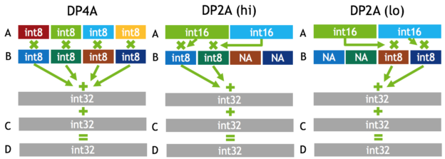   
当时人们关注的是推理能力，就像Titan V的“深度学习TFLOPS”一样，Titan X（Pascal）推出了“44 TOPS（新型深度学习推断指令）”。新的指令对4元8位向量或2元8位/16位向量执行整数点积，从而得到一个32位整数积，可以与其他32位整数一起累积。

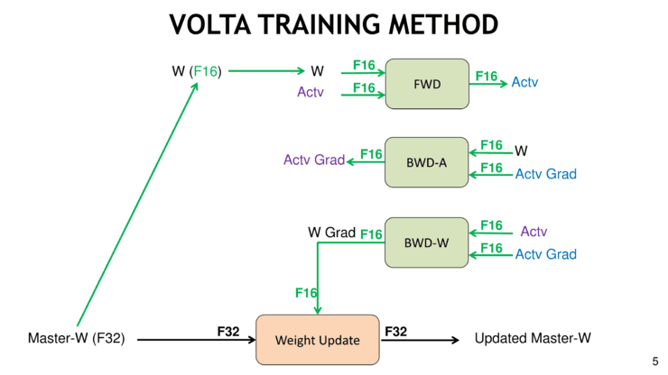   

对于Volta的混合精度而言，重要的精度敏感数据（如主权重）仍然会存储为FP32；而Tensor Core的混合精度训练则会将两个半精度输入矩阵相乘得到一个精度乘积，然后累积成一个精度和。NVIDIA表示，在将结果写入内存之前，Tensor Core会将结果转换回半精度，这样当使用半精度格式时，寄存器和存储器中需要的数据更少，这有助于处理超大矩阵中的数据。

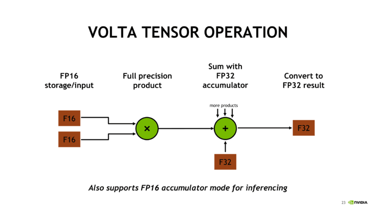   
FP16与FP32所包含的数据空间并不相同，归一化方法可以解决FP32格式数据超出FP16可表示范围的问题。举个例子，许多激活梯度的值都落在FP16的范围之外，但由于这些值聚集在一起，因此将损耗乘以缩放因子便可以移动FP16范围内的大部分值。在完成最终的权重更新之前，将梯度重新缩放到原始范围，便可以维持其原始的精度。

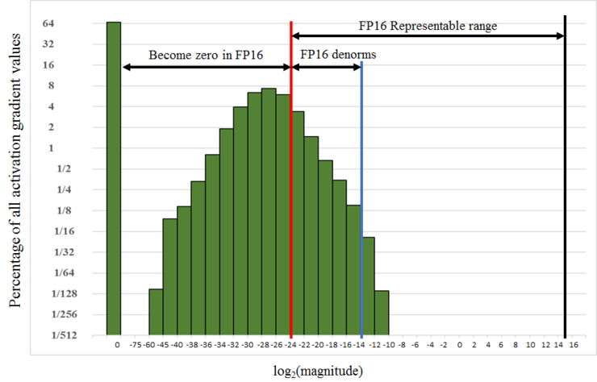   
不过，并非所有的数学、神经网络和层都适用于FP16，通常FP16和Tensor Core的混合精度最适合卷积和RNN重图像处理等，而对于不适合的神经网络框架或类型，FP16将默认禁用或不推荐使用。

## 五、内存改进，SM变化
使用Tensor Core处理混合精度数据似乎可以减轻内存带宽问题，但事实证明，尽管Volta在几乎所有方面都得到了内存子系统的增强，但幅度并不明显。

首先，Volta有一个12 KB的L0指令缓存，虽然Pascal及其他之前的GPU核心也有指令缓存，但Volta更高效的L0是子核心SM分区私有的，因此它对warp调度器来说也是私有的，这对Volta架构更大的指令大小是一种补偿，并有可能为支持Tensor Core通道的框架做出贡献。同时Volta指令延迟也要低于Pascal，特别是核心FMAs从6个周期减少到了4个周期。

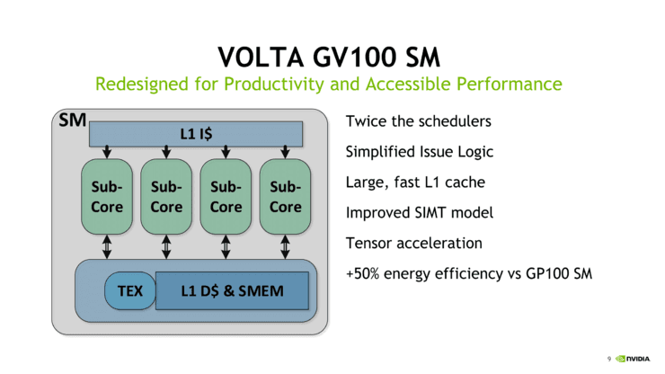   
随着每个SM中调度器比例的增加，砍掉第二个调度端口似乎是对具有独立数据路径和数学调度单元的子核心的权衡。而具备FP32/INT32执行能力，也为其他低精度/混合精度模型打开了大门。这些子核方面的增强，都是为了优化Tensor Core阵列。

另一个重大变化是合并L1缓存和共享内存。在同一个块中，共享内存可配置为每SM 最高96 KB。HBM2控制器也进行了更新，其效率提高了10~15%。
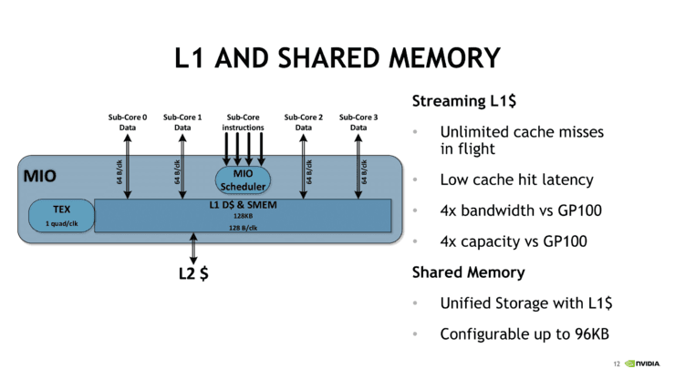   
## 六、深度学习基准测试
很多时候，深度学习这样的新领域会让人难以理解。从框架到模型，再到API和库，AI硬件的许多部分都是高度定制化的，因而被行业接受的公开基准测试工具很少也就不足为奇。随着ImageNet和一些衍生模型（AlexNet、VGGNet、Inception、Resnet等）的影响，ILSVRC2012（ImageNet大规模视觉识别挑战）中的图像数据集训练逐渐被行业所认可。

基本上所有现代深度学习框架都支持CUDA和cuDNN，对于Volta而言，所有支持FP16存储的框架也都支持Tensor Core加速，启用FP16存储后Tensor Core加速会自动启用，因此我们可以利用这些框架来了解Tensor Core的性能。

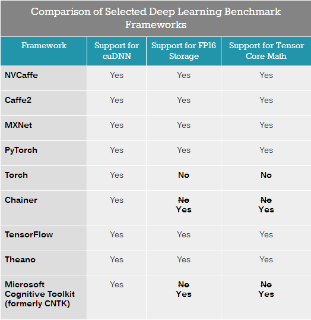   

在常见的第三方深度学习基准套件中，Fathom和TBD是更传统的基准测试套件，其测试针对特定框架和模型进行了配置，涵盖了许多不同的机器学习应用程序。 同时，最近的深度学习框架侧重于比较给定模型和跨框架的数据集的性能。

而DeepBench本身并不使用框架，而是使用低级库来评估不同设备的机器学习性能。就其本身而言，虽然它并不直接将框架/模型/应用程序性能与其他测试联系在一起，但它提供了代表供应商优化的数学操作和硬件性能的指标，每个产品的二进制文件都使用硬件供应商提供的库进行编译。
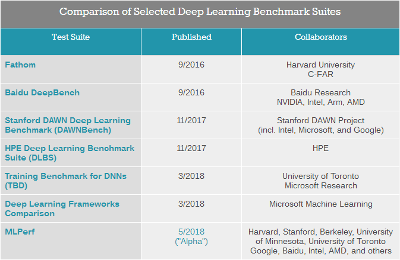   

DAWNBench则更加与众不同，与其说它是一个基准测试套件，不如说是对三个数据集（ImageNet、CIFAR10和SQuAD）的训练和推断结果进行类似于竞赛的报告，重点考量端对端的计算精确度和成本。

至于HPE DLBS，作为HPE深度学习指南的一部分，它主要以GPU为中心，坚持使用TensorFlow、MXNet、PyTorch和Caffe类型框架，还包括TensorRT测试。虽然其具有良好的多测试批处理、日志记录、监控和报告功能，但它只输出纯粹的性能和时间指标，不涉及端对端的时间精度或成本。

从这些基准测试软件中可以看出，深度学习框架之间的差异很容易使测试结果变得毫无意义，从而影响我们对这些框架的研究。convnet-benchmark和PyTorch的创始人Soumith Chintala指出，如果没有机器学习的背景，很难独立地验证深度学习基准测试的准确性和范围，不过MLPerf测试项目似乎试图解决这个问题。

MLPerf是由DAWNBench等测试软件的设计者和工程师联合打造的全新高端基准测试套件，希望囊括Fathom的跨域测试方法以及DAWNBench对超过阈值精度模型的端对端计算时间考察。不过它目前正在处于alpha阶段，开发团队表示其尚不适合进行精确的硬件对比。

综合考虑之下，本次测试将不包含MLPerf项目，而是使用DeepBench、Caffe2 Docke、Stanford DAWN和HPE DLBS来进行。

## 七、DeepBench训练测试之GEMM和RNN
首先进行的是GEMM测试，利用某些深度学习应用程序（DeepSpeech、Speaker ID和Language Modeling）中的内核进行GEMM操作，测出的性能比在cuBLAS中运行纯矩阵-矩阵乘法更有代表性。

测试的结果在意料之内，启用Tensor Core可以大幅提升性能。深入研究细节可以发现，Tensor Core对于特定类型的矩阵-矩阵乘法会有特别的影响。

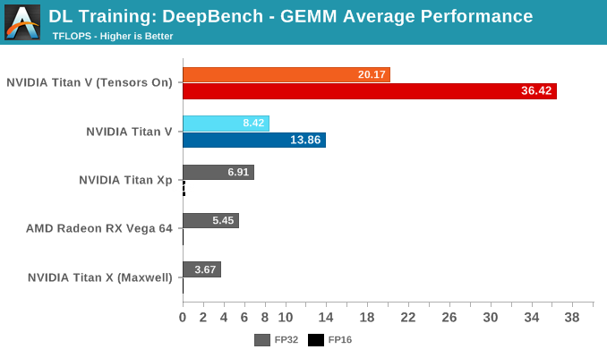   
通过深度学习应用程序拆分GEMM测试，我们可以了解Tensor Core在理想和非理想情况下的表现。

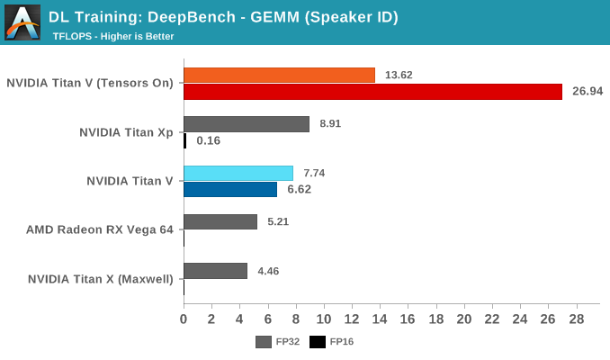   
Speaker ID GEMM工作负载实际上只包含两个内核，其中10微秒的时间差意味着大约1 TFLOPS的算力差异。   
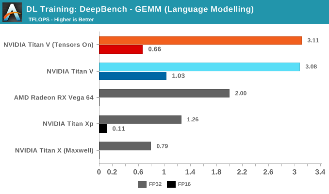   
通过对语言模型内核的研究，可以了解Tensor Core在非理想情况下的性能。这些核矩阵的大小是m=512或1024，n=8或16，k=500000，虽然每个数在技术上都可以被8整除——这是满足张量核加速度的基本要求之一——但这些矩阵的形状与Tensor Core支持的16\*16\*16、32\*8\*16和8\*32\*16等基本WMMA形状不太匹配。假如Tensor Core真正在独立的8x8x8级别上运行，那么运算8\*8\*8矩阵的性能也不会很好。

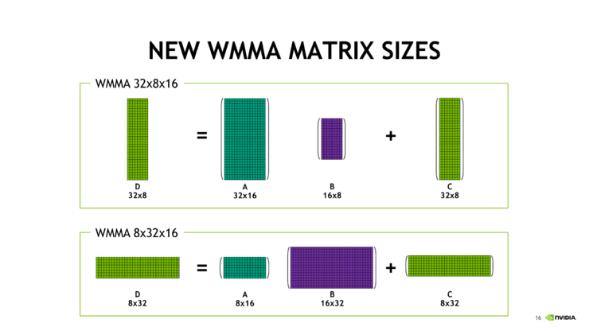   
因此，Tensor Core无法高效的将这些非常不平衡的矩阵分解为n=8或16。而且，Tensor Core在DeepSpeech内核上的性能也出现异常：

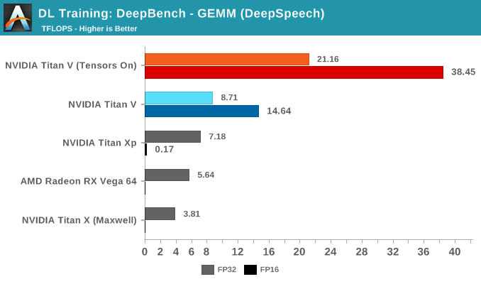   
从所有子项的平均成绩来看，这个浮点运算性能令人印象深刻。当矩阵适合于Tensor Core时，性能可以超过90TFLOPS；相反如果二者无法契合，并正确的换位没有发挥作用，性能会低至<1TFLOPS的水平。

对于DeepBench RNN内核的测试，RNN类型之间没有明显的差异，但是在每种RNN类型中，如果将不同内核挨个进行对比判断，也可以看到与GEMM中相同的趋势。

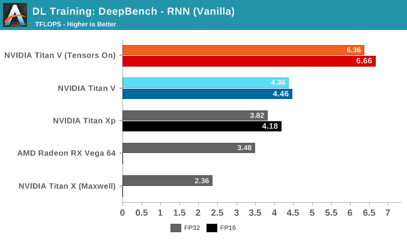    
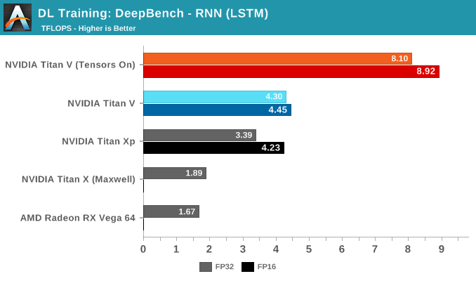   
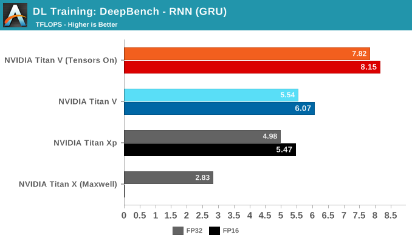   
比较有趣的是，Titan Xp与Titan V在未使用Tensor Core加速时的表现有很接近，Titan Xp的高频率为其性能起到了一定的帮助。

## 八、DeepBench训练测试之Convolutions
在卷积训练工作负载测试中，Tensor Core再次显着提高了性能。鉴于卷积层是图像识别和分类的基础，因而卷积运算是Tensor Core加速的最大潜在受益者之一。

从所有测试项的平均成绩可以看出，Volta在启用了Tensor Core的FP16混合精度运算能力后性能再次取得了领先。不过与GEMM不同，在FP32卷积上启用Tensor Core会导致明显的性能损失。

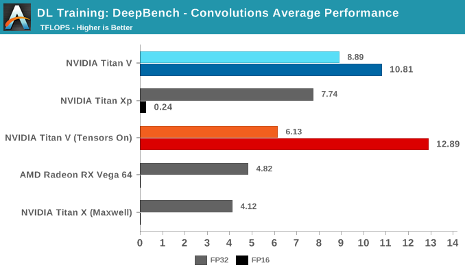  
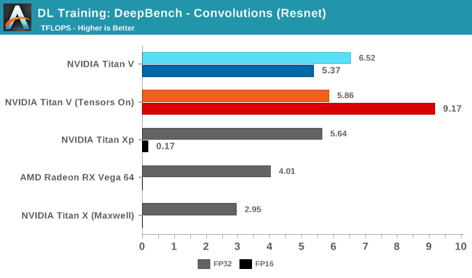   
当计算涉及不匹配的张量尺寸时，标准精度模式遵循cuDNN指定的最快前向算法（如Winograd），而混合精度模式必须对所有内核使用隐式预计算GEMM，这会造成两种混合精度模式的性能会出现下滑。

要符合Tensor Core加速的要求，输入和输出通道尺寸必须是8的倍数，输入、过滤和输出数据的类型必须是半精度。使用Tensor Core实现卷积加速要求张量采用NHWC格式，但大多数框架都希望采用NCHW格式的张量。在这种情况下，输入通道不是8的倍数，但测试程序会自动填充以解决此问题。

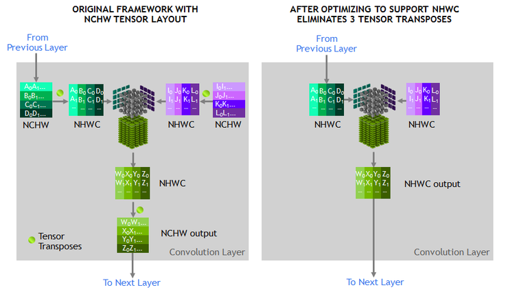   
需要注意的是，所有这些NCHW内核都需要转换为NHWC。想要从Tensor Core中受益，需要正确的调整卷积格式，本次测试使用的是NVIDIA提供的标准库和makefile。NVIDIA指出，一旦进行加速卷积，它会消耗掉相当多的运行时间，这将会对FP32和FP16混合精度模式造成影响。

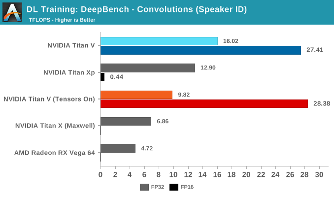   
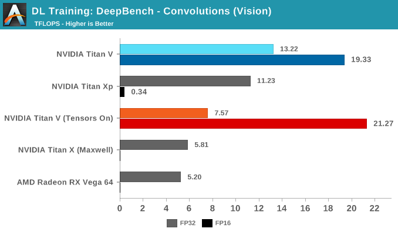   

## 九、DeepBench推理测试之GEMM
数据精度方面，百度将DeepBench GEMM和卷积定义支持32bit累加的INT8格式，以支持Volta和Pascal上的INT8计算。

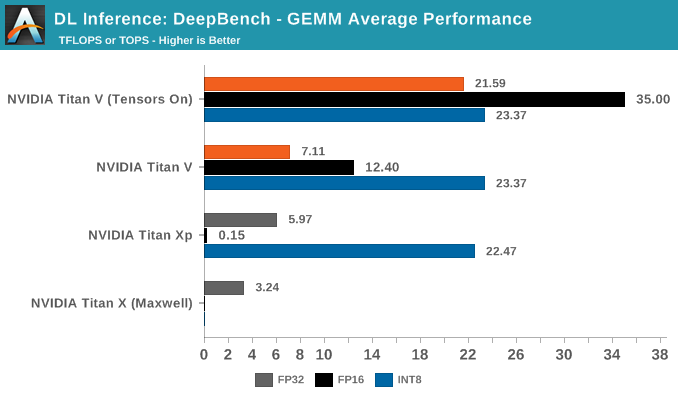   
Titan V和Titan Xp均拥有4倍于INT32的INT8性能，DeepBench的INT8推理测试正中Pascal引入的DP4A矢量点积能力之下怀。Volta同样拥有这一能力，在指令集中二者均显示为IDP和IDP4A。

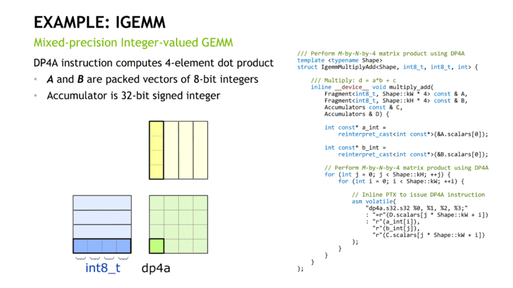   
对IGEMM来说，正如CUTLASS所示，DP4A是一项定制操作。因此除语言建模之外，INT8的性能都非常之高。当然，与硬件不匹配的张量尺寸不适合Tensor Core加速，这一点与之前完全一样。

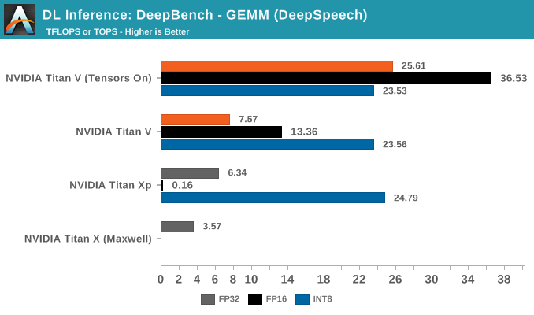   
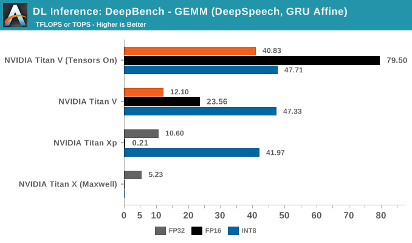   
在完全连接（仿射）层中，每个节点都与前一层中的各节点相连接。对于一个典型的CNN来说，完全连接的层意味着可以结合所有提取的特征做出最终预测并对图像进行分类。这些测试结果数据也意味着大型且规则的矩阵可以在Tensor Core加速中获得更大的收益。

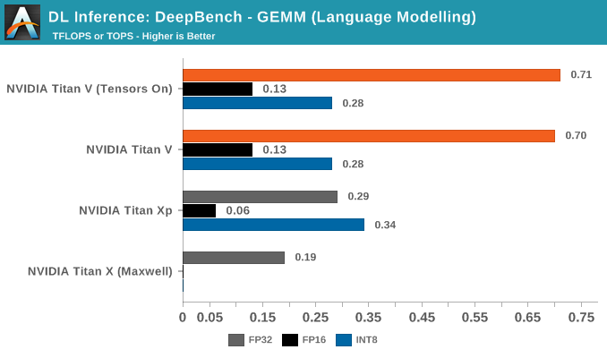   
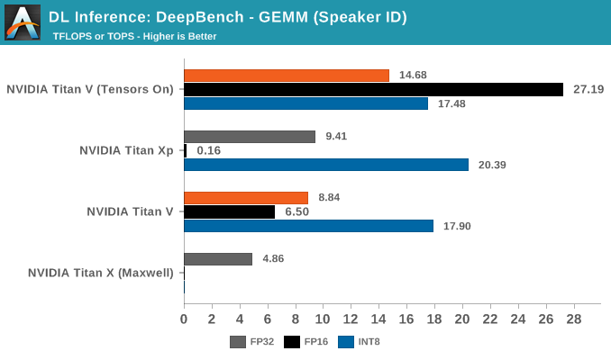   
## 十、DeepBench推理测试之Convolutions
再次来到卷积测试环节，8位乘法/32位累加再次出现在INT8推理中。

测试中最引人注目的是Titan Xp，在Resnet、Speaker ID和Vision项目中，Titan Xp表现出了强劲的INT8吞吐量。

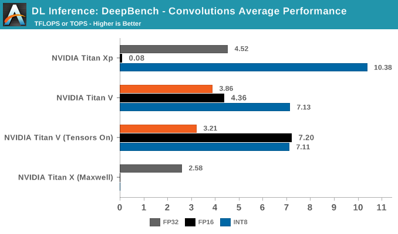  
从内核方面来看，并没有发现这一现象的根源所在，猜测可能是由于Pascal的DP4A库好驱动程序比Volta更为成熟所致，亦或许是Volta通过单独的INT单元处理这些运算。
   
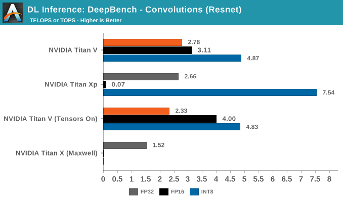   
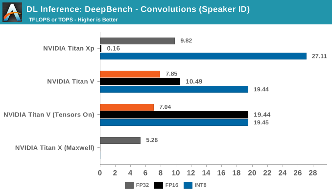   
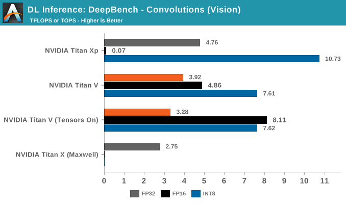   
## 十一、DeepBench推理测试之RNN和Sparse GEMM
DeepBench的最后一项推理测试是RNN和Sparse GEMM，虽然测试中可以选择FP16，但实际上它们都只支持FP32运算。

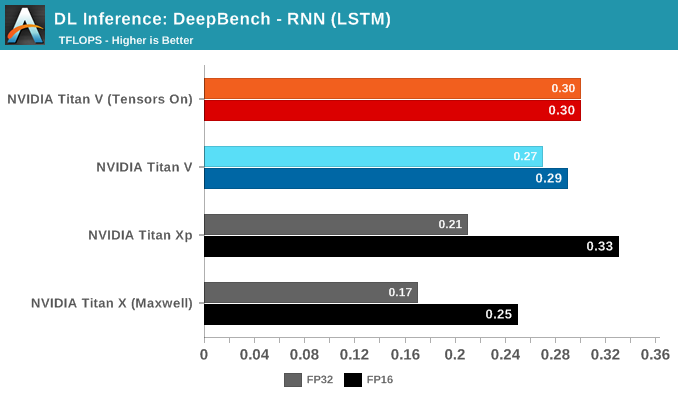   
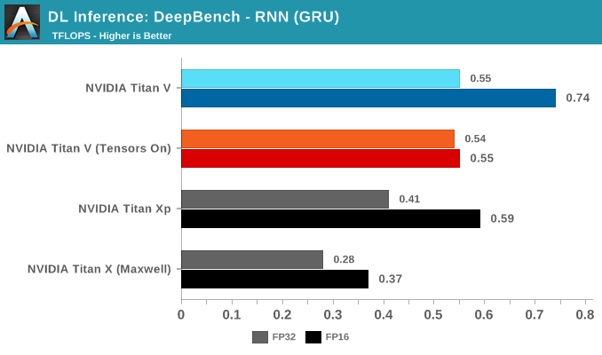   
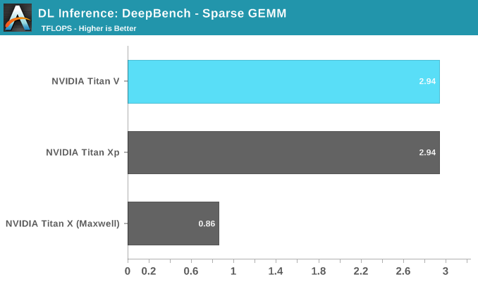  

虽然RNN可能会有加速，但DeepBench和NVIDIA目前仅支持单精度RNN推理。

## 结语
Tensor Core是Titan V的重要组成部分，本文的目的也是尽可能的了解Volta，所以测试着重考察了Tensor Core加速。

本次测试还有许多没有涉及到的各种其他测试和套件，它们普遍在设计上有太多欠缺。事实证明，无论从整体还是局部来看，都不可能找到一个负载贴合当下实际、提供端到端指标、覆盖多个机器学习域、支持Tensor Core和混合精度，最重要的是易于非专业开发者使用的深度学习套件。

即便是参考价值较大的DAWNBench，设计本意也并非提供一个通用的基准，而是为方便研究者和开发者创建他们自己的实现。DAWNBench的深度学习框架仍然需要修改以作为一款有效的基准测试使用，但重新配置一个与Volta兼容的混合精度模型就不是一件可以轻松完成的事情。

这实际上与Titan V自身相关，Tensor Core和混合精度需要专门的开发来适配支持，只能在特定情况下明显提升性能。且即便用户的代码和数据集可以与Tensor Core良好的匹配，到头来神经网络处理也会受到来自传统ALU的限制。

而对于主流消费者群体来说，Tensor Core的发展对他们意味着什么？最新的Turing架构证明，Tensor Core在游戏卡领域同样可以有所应用。雷锋网(公众号：雷锋网)曾在NVIDIA RTX 2080Ti/2080/2070发布时报道过，RTX光线追踪技术就是使用Tensor Core对图像进行降噪以弥补光线数量的限制。NVIDIA唯一需要考虑的问题是，这些玩家是否乐意为这些Tensor Core买单。

-----
## Reference
[1] https://www.leiphone.com/news/201808/RsZr7QRlQMfhMwOU.html    
[2] https://www.leiphone.com/news/201808/2J6ql9o0gseuIBYY.html